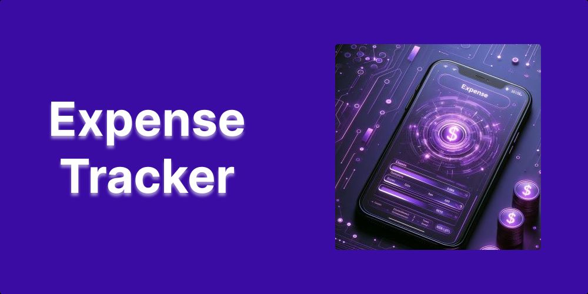
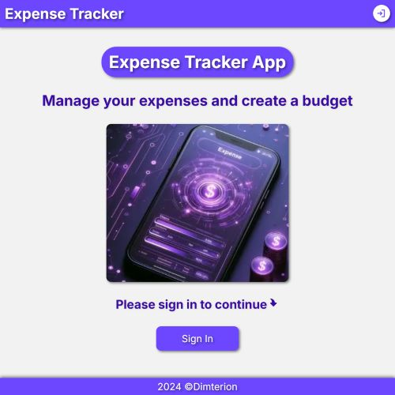
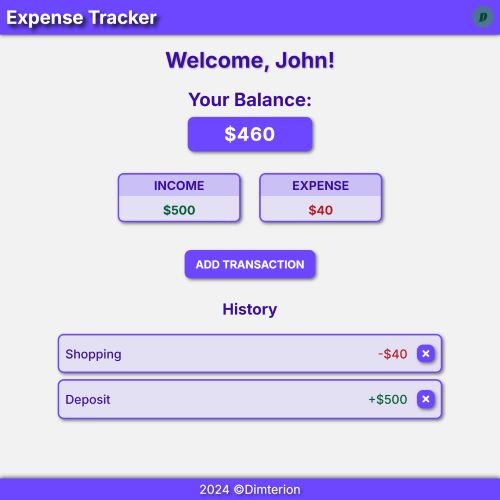

# Expense Tracker

  

## A Full-Stack application to track income and expenses

[Live Version](https://expense-tracker-lac-eta.vercel.app/)

## Features

- Create account (standard login/password or Google authentication)
- Add transactions (expenses/income)
- Delete transactions (expenses/income)
- Track transactions history
- Track overall balance as well as current sum of expenses and income
- Manage account details (Clerk)

## Screenshots

### Guest home page

  

### User home page

  

## Built with

- Next.js
- TypeScript
- Clerk
- Neon
- Prisma
- CSS
- React Toastify
- React Icons
- Prettier
