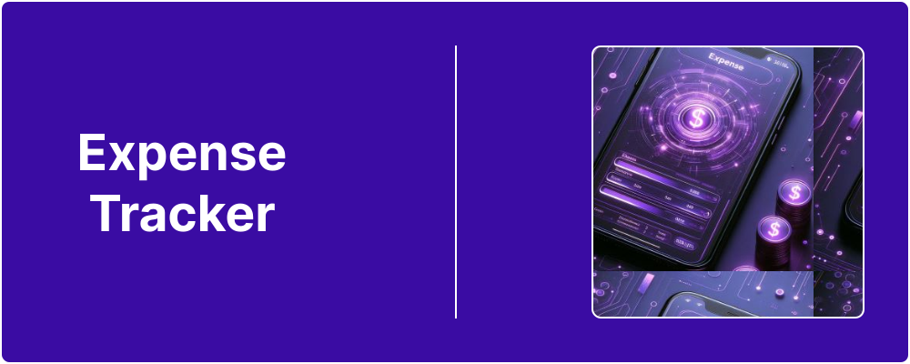
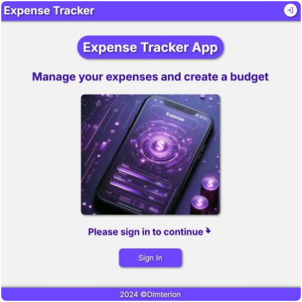
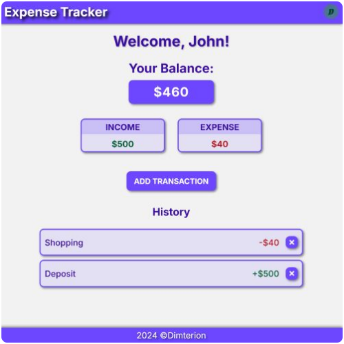

  

# Expense Tracker

Next.js / TypeScript application

## 📋 Table of Contents

- [Introduction](#introduction)
- [Features](#features)
- [Screenshots](#screenshots)
- [Tech Stack](#tech-stack)
- [Live Version](#live-version)
- [Contact Info](#contact-info)

## 🔎 Introduction

Expense Tracker is a full-stack application designed to help track users income and expenses.

## 📌 Features

- Create account (standard login/password or Google authentication)
- Add transactions (expenses/income)
- Delete transactions (expenses/income)
- Track transactions history
- Track overall balance as well as current sum of expenses and income
- Manage account details (Clerk)

## 📷 Screenshots

### Guest home page

**Caption:** Home page for unregistered users.

### User home page

**Caption:** Home page for registered users.

## ⚙️ Tech Stack

- Next.js
- TypeScript
- Clerk
- Neon
- Prisma
- CSS
- React Toastify
- React Icons
- Prettier
- Vercel

## 🔗 Live Version

### [Expense Tracker](https://expense-tracker-lac-eta.vercel.app/)

## 📫 Contact info

### Bio Link ⬇️

**Note:** Ctrl+Click (Windows/Linux) or Cmd+Click (macOS) the image to open link in a new tab.
